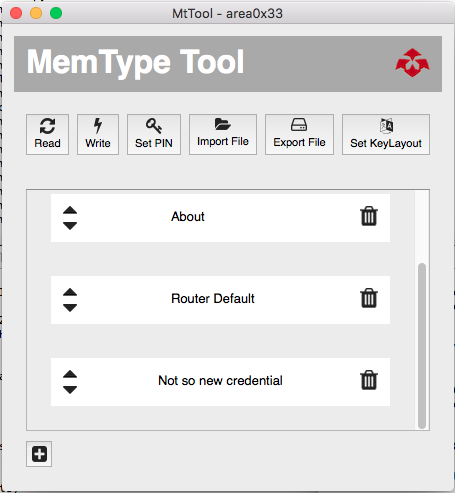

# MemTypeTool
MemType Tool - GUI For managing the [MemType Offline password keeper](http://www.area0x33.com/blog/?page_id=329):
 - [Project Sources.](https://github.com/jim17/memtype)
 - [Hackaday.io Project Page and build logs.](https://hackaday.io/project/8342-memtype-open-source-password-keeper)
 - [Get a MemType from Tindie!!](https://www.tindie.com/products/area0x33/memtype-open-source-password-keeper/)





##Dependencies
Make sure you have `python` and `PyQt4` installed.
```
Ubuntu Installation:
apt-get install python
apt-get install python-pyqt4
```
##Running
To run the **MemTypeTool**:

`python main.py`

##Keyboards
Using the GUI you can change the MemType keyboard layout to match your computer keyboard layout.
The current available layouts files are located under `keyboard` directory.

##About

* Miguel Angel Borrego
* Noel Carriquí
* [www.area0x33.com](http://www.area0x33.com)
